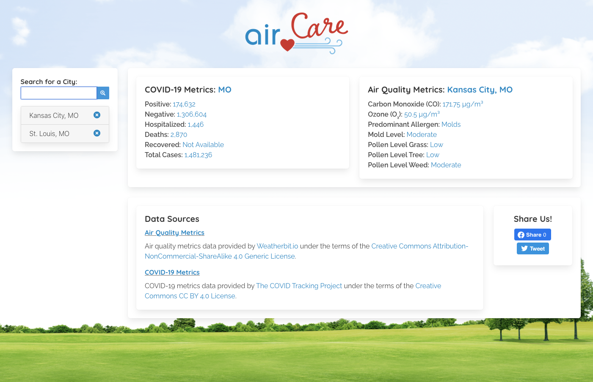

# Air Care

## Purpose

This dashboard web application was my the first project in the KU Coding Boot Camp. We were placed into small teams and given roughly a week and a half to come up with a concept, design it using a wire frame like sketch, select and use at least two different APIs to integrate, develop the app using HTML, CSS, JavaScript, and jQuery, and present it to the class.

The purpose of this project was to experience what it is like to collaborate with others on a coding project. We had to learn how to create feature branches, pull requests, and resolve conflicts without causing additional issues, all while doing everything remotely. While we had some challenges at times trying to work through the new collaboration concepts, we ultimately developed an MVP website we are proud of sharing with others!

This particular web application required me to research and utilize Moment.js for working with dates and times. It also required the use of Local Storage for storing the user inputs on each time block.

-----

## Description

This website was designed to be used by people who care about the air, whether that be from an environmental view, health view, or otherwise. In the age of extreme climate change, rising pollution levels, and a global pandemic, it is more important than ever to be well-informed about everything impacting the air we breathe on a daily basis!

Users are able to search for any city and state combination within the United States, and they will be presented with data about that location related to the air and/or breathing. At this time, these include current COVID-19 Metrics and Air Quality Metrics, including common pollutants and allergens. Furthermore, each searched city is saved in a list, so users can simply click on a previously searched city to display current metrics rather than search again. Users can also delete saved cities if they no longer wish to keep them in the list. Finally, users can share the website to Facebook or Twitter using the social sharing buttons.

-----

## User Story

The application itself had the following User Story:

```text
As an individual with breathing or respiratory concerns, I need to be able to view the air quality and COVID-19 metrics for a desired location, so that I can understand my risk of experience potential health issues.
```

-----

## Acceptance Criteria

The application itself had the following Acceptance Criteria:

```text
GIVEN I am using dashboard to obtain metrics
WHEN I open the dashboard
THEN the application lives within a single container on one page
WHEN I review the opening state of the dashboard
THEN I am presented with the data source information for the metrics to be displayed
WHEN I search for a city and state combination
THEN I am shown AutoComplete options to choose from
WHEN I select a city and state combination
THEN I am presented with Air Quality & COVID-19 Metrics and city is saved in a list
WHEN I refresh the page
THEN the saved events persist
WHEN I click on a saved city in the list
THEN I am presented with the metrics for that city
WHEN I click the "x" button on a saved city
THEN the city is removed from the saved list and local storage
WHEN I click on a social sharing button
THEN I am able to share the website to either Facebook or Twitter
WHEN I resize my window or view the website on a mobile device
THEN I am shown a responsive page with elements that rearrange without issues
```

-----

## Deployed Version

<https://timothykemp.dev/aircare>

-----

## Original Wire Frame Image

This was our original wire frame prototype design:


-----

## Screenshots

The following image shows the web application's appearance after searching for a city, with a saved city stored:



-----

## Future Development - Wish List Features

1. Having the data expand to different dates
1. Add map that centers on searched/clicked city with COVID-19 testing sites
1. Add icons to data metrics
1. Prevent API calls with empty local storage
1. Cache API responses for searched cities to prevent duplicate calls
1. Display top (most recent) city in list when deleting other cities
1. Fix remove button locations
1. Add copyright data with our names
1. Display charts that coincide with data metrics
1. Hide API key for Google Maps

-----

## APIs Used

1. COVID Metrics - <https://covidtracking.com/data/api>
1. Air Quality & Pollen Metrics - <https://www.weatherbit.io/api>
1. Google Maps JavaScript & Places - <https://developers.google.com/maps/documentation/javascript/overview>
1. Google Places - <https://developers.google.com/places/web-service/overview>

-----

## Third-Party Libraries

[Bulma CSS](https://cdnjs.cloudflare.com/ajax/libs/bulma/0.9.1/css/bulma.min.css)

[Font Awesome](https://use.fontawesome.com/releases/v5.15.1/css/all.css)

[Google Fonts](https://fonts.googleapis.com/css2?family=Quicksand:wght@700&family=Raleway:wght@400;600&display=swap)

[jQuery](https://code.jquery.com/jquery-3.4.1.min.js)

-----

## Credits

Designed & Built by David French, Timothy Kemp, and Raihan Akter