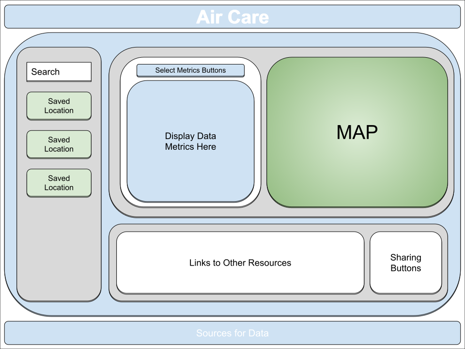

# project_1_group_4

## User Story

1. As an individual with breathing or respiratory concerns, I need to be able to view the air quality and COVID metrics for a desired location, so that I can understand my risk of experience potential health issues.

## APIs

1. COVID Testing Sites - <https://developer.here.com/documentation>
1. COVID Metrics - <https://covidtracking.com/data/api>
1. Air Quality & Pollen Metrics - <https://www.weatherbit.io/api>

## MVP Features To Include

1. Everything lives in one container (single page web application)
1. Include source information for legal reasons
1. Ability to search for a location
    1. By ZIP Code
    1. By City, State
    1. By Address
1. Buttons on city search panel to choose between Air Quality or COVID metrics
1. Display a maximum of 5 cities in the panel on the left
1. Ability to delete a city from the saved cities
1. Lookup coordinates of location using Location IQ API to be used with other APIs
1. Ability to choose date range
    1. Drop down choices of day, week, month, year
1. Display COVID Metrics
    1. Positive Tests
    1. Recovered Patients
    1. Color coded safety areas
    1. Testing sites
1. Display Air Quality Metrics
1. Display Pollen Metrics
1. Display Wildfire Metrics

## Wish List Features

1. Ability to save
1. Ability to share via social media or email
1. Ability to print without formatting issues
1. Include charts or graphs
1. Ability to search for any location in the world
1. Display Weather Metrics
1. Include heat maps with actual maps - <https://wiki.openstreetmap.org/wiki/API_v0.6>

## Wire Frame Image

This is our current wire frame prototype design:

